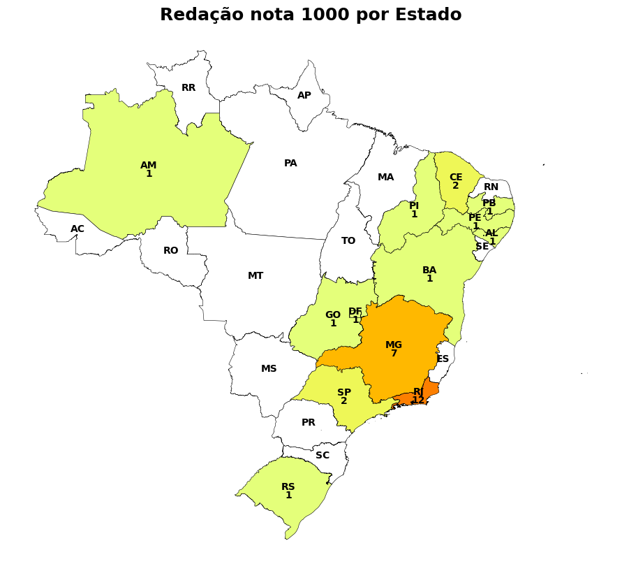
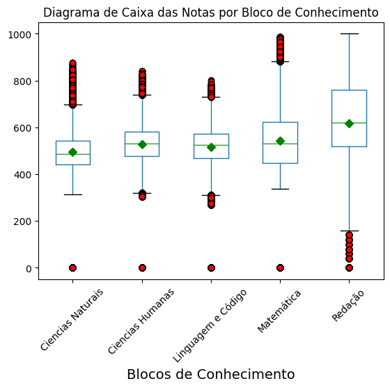
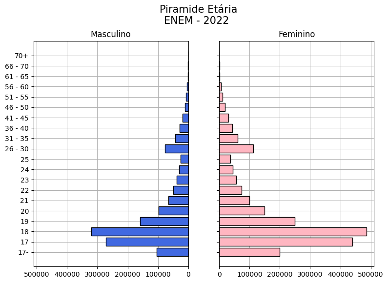
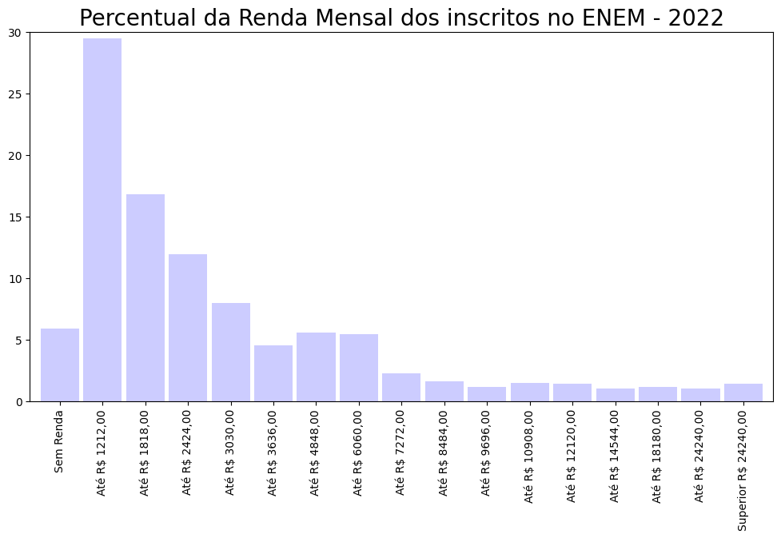
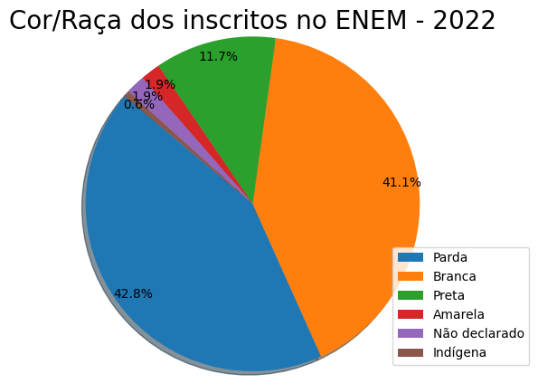

# Projeto_Mod04_Ada_VemSerTech
Repositorio para o desenvolvimento do projeto 4 Grupo B - Técnicas de Programação I

# Equipe:
- Adriely
- Amanda
- Daniel
- Lorrany
- Ricardo
- Thiago

# Análises de dados em Python dos microdados do ENEM 2022

Este repositório contém um conjunto de scripts em Python para realizar análises de dados dos microdados do ENEM 2022.

Primeiramente foi realizado uma limpeza de colunas do arquivo original para facilitar o manuseio do arquivo, deixando-o mais leve. O processo realizado está disponível no script entitulado ``limpeza_dados.ipynb``. Devido o github não suportar o carregamento dos dados originais, ele não está presente no repositório, porém pode ser adquirido no site do INEP:
[Microdados Enem 2022](https://www.gov.br/inep/pt-br/acesso-a-informacao/dados-abertos/microdados/enem)

Para usar os scripts, você precisará instalar os seguintes pacotes Python:

- ``pandas``
- ``geopandas``
- ``matplotlib``
- ``Seaborn``

## Análises Realizadas

1- Análise dos presentes, ausentes e eliminados nos dois dias de prova.

2- Análise do Diagrama de Caixa das Notas por Bloco de Conhecimento.

3- Análise da distribuição de acordo com o sexo na realização da prova (M-masculino / F-Feminino)

4- Análise da distribuição de acordo com o Estado Civil.

5- Análise da distribuição de acordo com a Raça/Cor.

6- Análise da distribuição de acordo com a Situação de Conclusão Escolar.

7- Análise da distribuição de acordo com o Tipo Escolar (Pública ou Privada). Analisamos a média das notas de cada disciplina pelo tipo de escola.

8- Análise do total de participantes por estado.

9- Análise da quantidade de redações nota 1000 por estado.

10- Análise da renda mensal dos participantes.

11- Análise da comparação da Média do enem com a Renda e Grupo Étnico/Racial.

12- Análise das maiores médias.

## Gráficos Utilizados

    
|  |  |  |
|:--:|:--:|:--:|
| **Mapa Geográfico** | **Diagrama de Caixa** | **Gráfico de Pirâmide** |
    

    
|  |  | 
|:--:|:--:|
| **Gráfico de Barras** | **Gráfico de Pizza** | 

    

## Conclusões

1- 

2- Os outliers inferiores das provas objetivas ocorreram quando o aluno zerou a prova.
- A redação foi a prova com a maior dispersão de dados.
- As notas de ciências humanas tem mediana próxima a média, isso significa que a distribuição dos dados é simétrica. A média próxima da mediana significa que a maioria dos alunos teve notas semelhantes. Ou seja, não houve muitos alunos com notas muito altas ou muito baixas.
- Nas notas da prova de linguagem e código, podemos observar que o tamanho da caixa é menos, isso indica que a maioria dos alunos teve notas semelhantes, próximo a mediana.
- Na prova de matemática, podemos observar maior dispersão dos dados maiores que a mediana em relação as notas menores que a mediana.

3- Podemos observar que a maioria dos inscritos são do sexo feminino, o que está de acordo com as estatística da população brasileira.

4- Pelo fato da maioria dos inscritos serem jovens, isso reflete na grande maioria de inscritos solteiros.

5- A maioria dos inscritos se auto declararam como pardo, o que condiz com a população brasileira.

6- A maior parte dos inscritos já haviam finalizado o ensino médio ou com finalização prevista para o final do ano da aplicação da prova, tal informação pode ser um indicativo pelo interesse para ingressar no ensino superior gratuito.

7- Concluímos que estudantes de escolas privadas obtiveram uma nota média maior no ENEM 2022 em comparação com os estudantes de escolas públicas.
Essa disparidade pode indicar diferenças nos recursos educacionais que impactam o desempenho acadêmico.

8- A distribuição dos inscritos por renda mostra que as classes socioeconômicas mais baixas têm mais interesse na prova do Enem, pela oportunidade de mudança de vida através do ensino superior gratuito.

9-Dos quase 2,4 milhões de participantes do ENEM 2022, apenas 32 (0,001%) alcançaram a nota máxima na redação. Entre os estados, somente 12 estados brasileiros e o Distrito Federal tiveram estudantes que conquistaram a pontuação máxima (1000) nessa prova. Destaca-se a região Sudeste, que se sobressaiu com um total de 21 redações nota 1000, sendo o estado do Rio de Janeiro responsável por 12 dessas pontuações, representando 37,5%. A região do Nordeste também merece destaque, apresentando um índice de sete redações com nota máxima

10-

11-A análise visual revela padrões nas médias de notas do ENEM em relação à renda e etnia. Observa-se que pessoas de renda mais alta possuem médias mais altas. E que pessoas brancas possuem médias mais altas que os outros grupos étnicos, independente da renda familiar. E a presença de outliers realça valores atípicos, enquanto as linhas no interior das caixas indicam a mediana.

12-